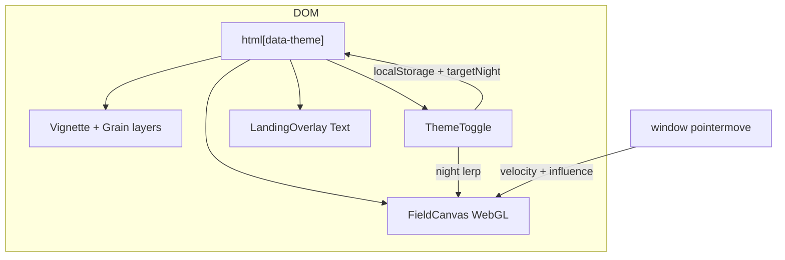

# feat: Pennant responsive React web landing with WebGL field

## Overview

Ship a **marketing landing page** for Pennant as a **React web** app: full-viewport **live WebGL** background matching `pennant-cursor-prompt.txt` (see Sources), with a **DOM overlay** that implements **Paper** copy, hierarchy, and **variable typography** (Job Clarendon Variable + SF Pro stack). Layout must be **mobile-responsive** while preserving shader behavior (pointer model, DPR cap, theme persistence).

---

## Problem Frame

Pennant needs a public-facing hero that matches the **cinematic field** already specified for the HTML/WebGL demo and the **typographic system** locked in Paper. The workspace is **greenfield**; there is no existing app shell to extend. (see origin: `docs/brainstorms/2026-04-29-pennant-react-web-landing-brainstorm.md`)

---

## Requirements Trace

- R1. **Live WebGL field** — Fragment behavior, uniforms, cursor wake rules, day/night lerp, grain/vignette, and theme toggle semantics align with the field spec (hard rules in prompt: no radial cursor push, no idle motion, no cursor glow, smootherstep bottom fade, off-canvas lights).
- R2. **Paper copy** — Wordmark, three display lines, body paragraph, and matchup row placeholders match Paper strings and casing intent (display lines uppercase in UI).
- R3. **Variable typography** — Job Clarendon Variable uses `wght` / `wdth` (and `font-feature-settings` for `ss03`, `ss04`, `ss07` where specified). Body uses SF Pro where available with a documented fallback stack for non-Apple clients; sizes and line-heights trace to Paper (with responsive scaling).
- R4. **Responsive layout** — Readable type and comfortable line length on narrow viewports; canvas remains full viewport; overlay does not break shader pointer handling.
- R5. **Theme** — `data-theme` on `html`, `localStorage['pennant.theme']`, ~600ms night lerp to uniform as in spec.
- R6. **Performance baseline** — DPR capped at 2; resize handled; acceptable frame time on mid-tier mobile (defer exact thresholds to implementation profiling).

---

## Scope Boundaries

- **Not in scope:** Native React Native app, authenticated product UI, CMS, analytics wiring (can stub), real team logos in matchup row (placeholders until assets exist).
- **Deferred to follow-up:** Lazy WebGL load + degraded fallback (still/CSS) if metrics show need; blog/legal pages; i18n.

### Deferred to Follow-Up Work

- **Optional GL fallback:** Static hero image or CSS-only mode when WebGL unavailable (brainstorm Approach B).
- **Real matchup assets:** Replace letter placeholders with SVGs or images from design.

---

## Context & Research

### Relevant Code and Patterns

- **Greenfield** — No application code yet; establish conventions in this repo from the first PR.
- **Authoritative visual spec:** Paper file “Pennant” / artboard “Pennant Landing Page” (via design tool export); **field motion spec** in user-provided `pennant-cursor-prompt.txt` — **vendor a copy into this repo** under `docs/specs/` (or `reference/`) so builds do not depend on absolute paths on one machine.

### Institutional Learnings

- None located under `docs/solutions/` in this workspace.

### External References

- WebGL / shader: existing single-file HTML approach implied by prompt; React integration uses canvas + `requestAnimationFrame` pattern.
- CSS variable fonts: `font-variation-settings`, `font-feature-settings` for Clarendon.

---

## Key Technical Decisions

- **Bundler / framework:** **Vite + React + TypeScript** for fast local dev and simple static deploy (adjust in plan if the repo later standardizes on Next.js for SSR/SEO).
- **Shader ownership:** Isolate field in a dedicated module (e.g. `src/field/`) with the fragment/vertex sources as strings or imported GLSL files; React component only handles lifecycle, sizing, and uniform bridges.
- **Layering:** Fixed full-viewport canvas at z-index 0; CSS vignette + grain + theme toggle as in prompt; scrollable or centered **content column** above with pointer-events set so the canvas still receives movement where intended (verify: overlay uses `pointer-events: none` on full-bleed wrappers except interactive controls).
- **Fonts:** Self-host **Job Clarendon Variable** (license-compliant files in `public/fonts/` or similar). SF Pro: **system-ui stack** targeting `-apple-system` / `SF Pro Text` on Apple platforms; **no redistribution** of SF Pro files — use fallbacks elsewhere.
- **Responsive type:** Map Paper’s desktop px to `clamp()` for headings and body so mobile meets minimum legibility without breaking layout.

---

## Open Questions

### Resolved During Planning

- **React Native vs web:** **React web**, mobile-responsive (stakeholder correction during brainstorm).

### Deferred to Implementation

- **Exact breakpoint and clamp values:** Tune after first visual pass against Paper screenshot.
- **SEO:** Whether to add SSR later (Next) for social crawlers — not required for v1 static hosting if acceptable.

---

## Output Structure

```text
docs/specs/
  pennant-field-prompt.md          # vendored copy of field specification
public/
  fonts/                           # Job Clarendon Variable (licensed)
src/
  components/
    ThemeToggle.tsx
    LandingOverlay.tsx
    typography/
      DisplayLine.tsx
      Wordmark.tsx
      BodyCopy.tsx
      MatchupRow.tsx
  field/
    FieldCanvas.tsx
    shaders/
      fragment.glsl                # or .ts string export
      vertex.glsl
    useFieldPointerState.ts        # mouse smoothing, u_mouse, u_mouseVel
    useThemeNightUniform.ts        # lerp nightVal
  styles/
    global.css                     # fonts, theme tokens, grain, vignette
  App.tsx
  main.tsx
index.html
vite.config.ts
package.json
tests/ or src/**/*.test.tsx        # per-unit tests (see U5)
```

---

## High-Level Technical Design

> *This illustrates the intended approach and is directional guidance for review, not implementation specification. The implementing agent should treat it as context, not code to reproduce.*



---

## Implementation Units

- [x] U1. **Repository scaffold and design tokens**

**Goal:** Runnable React app with global CSS, theme variables, and vendored field spec in-repo.

**Requirements:** R4 (baseline layout), R5 (theme hook on document)

**Dependencies:** None

**Files:**
- Create: `package.json`, `vite.config.ts`, `tsconfig.json`, `index.html`, `src/main.tsx`, `src/App.tsx`, `src/styles/global.css`
- Create: `docs/specs/pennant-field-prompt.md` (copy from authoritative prompt file)
- Test: `src/App.test.tsx` (smoke: render without throw)

**Approach:**
- Wire Vite React TS template; set `lang`, viewport meta, and title for Pennant.
- Define CSS custom properties for day/night body backgrounds matching spec hex.

**Test scenarios:**
- **Happy path:** App mounts and `document.documentElement` has default theme attribute expected by spec.

**Verification:**
- `npm run dev` shows blank or placeholder page with no console errors.

---

- [x] U2. **WebGL field canvas and shader port**

**Goal:** Full-viewport canvas implementing the fragment/vertex logic and JS loop from the field spec (fade-in, mouse smoothing, asymmetric velocity, night lerp, resize + DPR cap).

**Requirements:** R1, R5, R6

**Dependencies:** U1

**Files:**
- Create: `src/field/FieldCanvas.tsx`, `src/field/shaders/*`, `src/field/usePointerUniforms.ts` (or split hooks), `src/field/constants.ts`
- Test: `src/field/FieldCanvas.test.tsx` — **Test expectation: none — WebGL not available in jsdom;** substitute with **logic-only tests** for smoothing/lerp helpers if extracted as pure functions, or document manual QA only for canvas.

**Approach:**
- Port GLSL and uniform wiring faithfully; keep “hard rules” from spec in comments or `docs/specs` checklist.
- Cap DPR at 2; handle device orientation / resize.

**Test scenarios:**
- **Happy path (pure helpers):** If `lerpNight` / velocity smoothing are pure, assert asymptotic approach to target over repeated ticks.
- **Edge case:** Zero dimensions or WebGL context loss — no uncaught throw (graceful no-op or message).

**Verification:**
- Manual: field matches description in prompt (stripes, chalk, night lights, bugs, wake); theme toggle persists reload.

---

- [x] U3. **CSS overlays: vignette, grain, theme toggle**

**Goal:** Match z-index stack from prompt: vignette radial, SVG grain, round toggle with sun/moon.

**Requirements:** R1 (visual continuity), R5

**Dependencies:** U1, U2

**Files:**
- Modify: `src/styles/global.css`
- Create: `src/components/ThemeToggle.tsx`
- Modify: `src/App.tsx`

**Approach:**
- Toggle flips `data-theme`, writes `localStorage`, notifies field via callback/context or custom event so `u_night` lerps.

**Test scenarios:**
- **Happy path:** Click toggle toggles `data-theme` between day and night.
- **Happy path:** Theme key persists across reload (use mock `localStorage` in Vitest).

**Verification:**
- Visual check: button position and icon swap per spec.

---

- [x] U4. **Landing overlay: Paper content and responsive typography**

**Goal:** DOM overlay with Paper copy; Job Clarendon + SF Pro stack; variable settings; fluid type.

**Requirements:** R2, R3, R4

**Dependencies:** U1

**Files:**
- Create: `public/fonts/*` (Clarendon variable), `src/components/LandingOverlay.tsx`, `src/components/typography/*.tsx`
- Create: `src/styles/typography.css` or co-locate in `global.css`
- Test: `src/components/LandingOverlay.test.tsx` — assert key strings render.

**Approach:**
- `@font-face` for Clarendon with `font-display: swap`.
- Use `font-variation-settings: "wght" 600, "wdth" 25` (example — **tune wdth** to match Paper’s ultra-condensed) and `font-feature-settings: "ss03", "ss04", "ss07"` on display blocks.
- Body: stack like `system-ui, -apple-system, "SF Pro Text", ...` with weight ~274 equivalent (`font-weight: 300` or variable if available on platform).

**Test scenarios:**
- **Happy path:** Full body paragraph text appears once.
- **Happy path:** Three display lines + wordmark present.
- **Edge case:** Narrow viewport — overlay still scrollable/readable (snapshot or RTL style query).

**Verification:**
- Side-by-side with Paper export: hierarchy and approximate line breaks.

---

- [x] U5. **Integration, accessibility, and polish**

**Goal:** `pointer-events` and stacking do not block field interaction; focus styles on toggle; reduced-motion consideration; meta/OG basics.

**Requirements:** R4, R6

**Dependencies:** U2, U3, U4

**Files:**
- Modify: `src/App.tsx`, `src/styles/global.css`, `index.html`
- Test: `src/a11y/landing.a11y.test.tsx` or extend `LandingOverlay.test.tsx` — toggle has `aria-pressed` or `role="switch"` and accessible name.

**Approach:**
- Ensure interactive elements are keyboard reachable; respect `prefers-reduced-motion` where feasible (may reduce entrance animation or shader-driven motion — document tradeoff).

**Test scenarios:**
- **Happy path:** Theme toggle exposes accessible name and toggles state.
- **Integration:** Moving pointer over field area still updates wake (manual checklist).

**Verification:**
- Manual pass on iOS Safari + desktop Chrome.

---

## System-Wide Impact

- **Interaction graph:** Only this marketing page; no backend.
- **Unchanged invariants:** N/A (greenfield).

---

## Risks & Dependencies

| Risk | Mitigation |
|------|------------|
| Job Clarendon licensing | Confirm font files may be self-hosted; otherwise substitute with purchased/licensed variable Clarendon. |
| WebGL blocked / poor mobile GPUs | Document minimum requirements; optional follow-up fallback. |
| SF Pro mismatch on Windows/Android | Accept fallback stack; match weights loosely. |
| Pointer events between overlay and canvas | Explicit `pointer-events` strategy in U4/U5. |

---

## Documentation / Operational Notes

- README: how to run dev server, where spec lives, font license note.
- Deploy: static hosting (Vercel/Netlify/S3) — no server required for v1.

---

## Sources & References

- **Origin document:** [docs/brainstorms/2026-04-29-pennant-react-web-landing-brainstorm.md](docs/brainstorms/2026-04-29-pennant-react-web-landing-brainstorm.md)
- **Field specification (vendor into repo):** user-provided `pennant-cursor-prompt.txt` (absolute path on author machine — copy to `docs/specs/pennant-field-prompt.md` during U1)
- **Design:** Paper — “Pennant” / “Landing Page” artboard (copy, colors, type styles)

---

## Alternative Approaches Considered

- **Next.js first:** Rejected for initial plan to minimize setup; migrate if SEO/SSR becomes mandatory.
- **Static background only:** Rejected — stakeholder requires live GL.

---

## Success Metrics

- Visual parity with Paper for typography and copy; shader behavior matches the prompt’s definition of done.
- Lighthouse: performance budget TBD; no critical a11y violations on toggle and headings.
