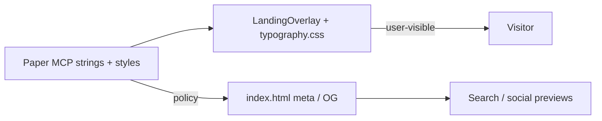

# feat: Align landing body + SOON matchup with Paper (copy + variable type)

## Overview

Take a **second implementation pass** on the marketing overlay so **on-page copy** and the **SOON / team matchup row** match the **current Paper** file (“Pennant”, page “Landing Page”), using **Paper MCP** for authoritative strings and **computed CSS** (including variable-font behavior). The user’s **current selection** (hero column **Frame** `L1W-0` on artboard **Pennant Landing Page** `L1V-0`) defines the scope for this reconciliation.

This plan **does not** restage the WebGL field; it focuses on `LandingOverlay` + `typography.css` (+ related meta/tests).

## Implementation note (2026-04-30) — SOON strip visual authority

The **shipped** matchup row follows the **approved solari / split-flap reference** (four equal columns, thin **`#1A281C`** vertical dividers, middle **O** as top/bottom glyph halves with a dark crease). That layout is implemented in [`LandingOverlay.tsx`](../../src/components/LandingOverlay.tsx) and landed via [PR #3](https://github.com/adam-zel/pennant-landing-page/pull/3).

**Paper file `L1X-0`** remains the best reference for **typography tokens** (Clarendon weight, size, shadow, shell chrome) and **copy** elsewhere on the hero. Where Paper’s **node tree** (stacked **O**s + green twin verticals + horizontal double rule) **diverges** from the solari reference, **treat the reference screenshot / product sign-off as controlling** for strip geometry—not a literal Paper MCP export of divider children.

See also: [docs/solutions/ui-bugs/pennant-soon-strip-solari-reference.md](../solutions/ui-bugs/pennant-soon-strip-solari-reference.md).

---

## Problem Statement / Motivation

- **Design source drift:** The brainstorm still lists an older body string (“…a baseball companion for iPhone…”) while **Paper and the repo overlay** now use “…your new baseball companion…”. The **Paper file is the copy authority** for this pass (see brainstorm principle in [docs/brainstorms/2026-04-29-pennant-react-web-landing-brainstorm.md](docs/brainstorms/2026-04-29-pennant-react-web-landing-brainstorm.md) — “Paper artboard… single source of truth”) (see brainstorm: docs/brainstorms/2026-04-29-pennant-react-web-landing-brainstorm.md).
- **Variable font parity:** Paper’s computed styles use **Job Clarendon Variable** with **`fontStretch: ultra-condensed`** and named instance weights (300 / 500 / 600); the web stack sets **`font-variation-settings`** for `wght` / `opsz` but **does not yet map `wdth`** to match ultra-condensed, which the prior plan called out as a follow-up ([docs/plans/2026-04-29-001-feat-pennant-react-web-landing-plan.md](docs/plans/2026-04-29-001-feat-pennant-react-web-landing-plan.md)).
- **SOON row structure:** ~~Prior draft~~ targeted Paper **`L1X-0`** nested dividers vs web. **Shipped (2026-04-30):** solari **four-column** strip — **S | O | split-flap O | N** with thin vertical rules; middle **O** is two clipped halves + crease (**not** Paper’s green horizontal pair). Paper still informs **type** on letters and **shell** styling where aligned.
- **Marketing vs DOM:** `index.html` meta/OG strings **differ** from `BODY_COPY` (shorter, “iPhone” framing). Crawlers and social previews will not match the hero paragraph unless explicitly reconciled.

---

## Paper MCP design context (2026-04-30)

**Selection:** Frame **“Frame”** `L1W-0` — children: wordmark, display stack frame, body text, matchup frame.

| Role | Paper node | Text / role | Notes |
|------|------------|-------------|--------|
| Wordmark | `L2P-0` | `Pennant` | 32px / 32px lh, wght 600, ultra-condensed, ss03–ss07, `#FEFAE0` |
| Display | `L2O-0` / `L2N-0` / `L2M-0` | `Baseball` / `Without` / `The Noise.` | 96px / 88px lh, uppercase, 600 / 300 / 600 |
| Body | `L2K-0` | Full paragraph (see below) | 16px / 24px lh, SF Pro Light **274** |
| Matchup letters | `L2J-0` … `L1Z-0` | `S` `O` `O` `O` `N` | 40px / 48px lh, wght **500**, ultra-condensed, text-shadow `#0000007A 0 2px 3px` |

**Body paragraph (authoritative from Paper `L2K-0`):**

> Pennant is your new baseball companion. Pick your team once. Open it every day. It tells you what's happening, who's playing, and where your team stands.

**Repo check:** `BODY_COPY` in [`src/components/LandingOverlay.tsx`](src/components/LandingOverlay.tsx) **matches this string exactly** — no copy edit required for the paragraph until Paper changes again.

**Matchup computed styles (representative):** All five letter nodes share Clarendon medium (500), 40px, 48px line-height, ultra-condensed, same shadow; **no** `ss03`–`ss07` on these nodes (unlike display/wordmark).

---

## Proposed Solution

1. **Lock a “copy + type contract”** in-repo (this plan + optional one-row table in README or comment block) listing: body string, meta policy, and Paper reference (page name + hero frame purpose). Update the **brainstorm** or add a short note pointing to **Paper** as superseding the old body row in the table (see brainstorm: docs/brainstorms/2026-04-29-pennant-react-web-landing-brainstorm.md).
2. **Variable typography**
   - Extend Clarendon rules in [`src/styles/typography.css`](src/styles/typography.css) with **`font-variation-settings` / `wdth`** (or `font-stretch`) aligned to Paper’s **ultra-condensed** for wordmark, display, and matchup cells — verify against [`@font-face`](src/styles/typography.css) axis range.
   - Body: Prefer **SF Pro** weight **274** where the stack supports it (e.g. `font-variation-settings: "wght" 274` on Apple system faces if effective in target browsers); document fallback to **300** for stacks where 274 is unavailable.
3. **SOON / matchup row (shipped — solari reference, 2026-04-30)**
   - [`LandingOverlay.tsx`](src/components/LandingOverlay.tsx): **four** horizontal slots **`S`**, **`O`**, **solari middle** (split-flap **O**), **`N`**; **three** thin vertical **`#1A281C`** dividers; document **decorative** `aria-hidden` intent in JSX comment.
   - [`typography.css`](src/styles/typography.css): shared letter styles on cells + solari halves; **no** Paper green twin-divider strip (superseded by product reference).
   - Shell / padding: **no** inner padding on `.pennant-matchup`; shell matches dark chip + inset shadow.
4. **SEO / social**
   - Decide single marketing message: either **align** `meta`/`og:*` with the hero paragraph, or **document intentional shortening** and align terminology (“iPhone” vs “new companion”) with product. Update [`index.html`](index.html) accordingly.

---

## Technical Considerations

- **Architecture:** Overlay remains a single presentational component; consider extracting **shared `BODY_COPY`** or a `copy.ts` module only if meta is generated or duplicated to avoid drift.
- **Performance:** Adding `wdth` has negligible cost; no shader changes.
- **Security / privacy:** None beyond existing public marketing copy.

---

## System-Wide Impact

- **Interaction graph:** Static text; theme toggle does not alter overlay copy.
- **Error propagation:** N/A.
- **State lifecycle:** None.
- **API surface:** None; **HTML meta** is the secondary public “API” for crawlers — keep in sync by policy.

- **Integration tests:** [`LandingOverlay.test.tsx`](src/components/LandingOverlay.test.tsx) asserts **three** `.pennant-matchup__cell` texts **S/O/N**, **scoped** strip queries, **two** solari halves each **`O`**, **three** dividers + crease **`aria-hidden`**, and shell **`aria-hidden`** (see PR #3 + [todo CE-REV-PR3-006](../../todos/006-pending-p2-pr3-tests-and-a11y-hardening.md)).

---

## Acceptance Criteria

- [ ] **Body paragraph** in the DOM matches **Paper `L2K-0`** verbatim (currently already true — re-verify after any Paper edit).
- [ ] **Wordmark + display + matchup** use Clarendon **variable** settings that include **width/condensed** behavior consistent with Paper (`ultra-condensed` / `wdth` in documented range).
- [ ] **Body** weight matches Paper intent (**274** with documented fallback), not only generic `300`.
- [x] **Matchup row** — **Solari reference (PR #3):** four columns **S | O | split-flap O | N**; **three** thin vertical **`#1A281C`** dividers; middle **O** = two half-height flex regions + dark crease; decorative strip + dividers + crease use **`aria-hidden`** per JSX comment; re-open if Paper or marketing supersedes this visual contract.
- [ ] **`index.html`** `<title>`, `description`, `og:title`, `og:description` follow an **explicit** policy (same prose as hero, shortened variant with rationale, or build-time single source).
- [ ] **Tests** updated: body substring; optional structural test for matchup **S-O-O-O-N** and **center divider** variant.
- [ ] **Brainstorm / docs:** Note that body copy in the old table is **superseded** by Paper (see brainstorm: docs/brainstorms/2026-04-29-pennant-react-web-landing-brainstorm.md) or refresh that row.

---

## Success Metrics

- Visual sign-off: overlay column at **394px** width matches Paper frame **L1W-0** for type hierarchy and matchup treatment.
- No accidental regression: CI green; a11y tests still pass.

---

## Dependencies & Risks

| Risk | Mitigation |
|------|------------|
| `wdth` values differ by build of Job Clarendon | Compare `get_font_family_info` + Paper export; tune once, document in CSS comment |
| SF Pro 274 not available on all platforms | Acceptable fallback per brainstorm (see brainstorm: docs/brainstorms/2026-04-29-pennant-react-web-landing-brainstorm.md) |
| Strip layout vs Paper tree diverge | Document **solari** as controlling (see Implementation note + [pennant-soon-strip-solari-reference.md](../solutions/ui-bugs/pennant-soon-strip-solari-reference.md)); re-sync if design picks literal **`L1X-0`** again |

---

## Research & external docs

- **Local research:** Repo overlay, typography, tests, meta — consolidated above.
- **`docs/solutions/`:** [ui-bugs/pennant-landing-ce-review-remediation.md](../solutions/ui-bugs/pennant-landing-ce-review-remediation.md) — responsive matchup/hero clamps, Clarendon `wdth` tokens, `<main>` landmark; [ui-bugs/pennant-soon-strip-solari-reference.md](../solutions/ui-bugs/pennant-soon-strip-solari-reference.md) — SOON strip design authority (solari vs Paper).
- **External framework docs:** **Skipped** — implementation is CSS/React-only; Paper MCP + existing plan provide sufficient grounding.

---

## Sources & References

- **Origin brainstorm:** [docs/brainstorms/2026-04-29-pennant-react-web-landing-brainstorm.md](docs/brainstorms/2026-04-29-pennant-react-web-landing-brainstorm.md) — variable-font and Paper-as-source decisions; **body string in the brainstorm table is outdated vs current Paper/repo** (see brainstorm: docs/brainstorms/2026-04-29-pennant-react-web-landing-brainstorm.md).
- **Prior plan:** [docs/plans/2026-04-29-001-feat-pennant-react-web-landing-plan.md](docs/plans/2026-04-29-001-feat-pennant-react-web-landing-plan.md) (R2/R3 trace).
- **Code:** [`src/components/LandingOverlay.tsx`](src/components/LandingOverlay.tsx), [`src/styles/typography.css`](src/styles/typography.css), [`src/styles/global.css`](src/styles/global.css), [`index.html`](index.html), [`src/components/LandingOverlay.test.tsx`](src/components/LandingOverlay.test.tsx).
- **Paper MCP (session):** File **Pennant**, page **Landing Page**; hero column **`L1W-0`**; matchup / **Coming Soon** frame **`L1X-0`** (computed styles for shell, letter wrappers, `L29-0`/`L25-0`, single divider rects **`L32-0`/`L31-0`**, double divider rects **`L28-0`/`L27-0`**). Prior pulls: `L2P-0`, `L2O-0`–`L2M-0`, `L2K-0`, `L2J-0`, letter nodes as cited above.
- **Coming Soon parity brainstorm:** [docs/brainstorms/2026-04-30-coming-soon-paper-parity-brainstorm.md](../brainstorms/2026-04-30-coming-soon-paper-parity-brainstorm.md) — Paper **`L1X-0`** notes + **Implementation update** (solari reference supersedes strip layout row).
- **Implementation playbook:** [docs/plans/2026-04-30-002-feat-pennant-paper-parity-implementation-playbook-plan.md](2026-04-30-002-feat-pennant-paper-parity-implementation-playbook-plan.md) — phased work order, SpecFlow edge cases, test reminders (**acceptance criteria stay in this file**).
