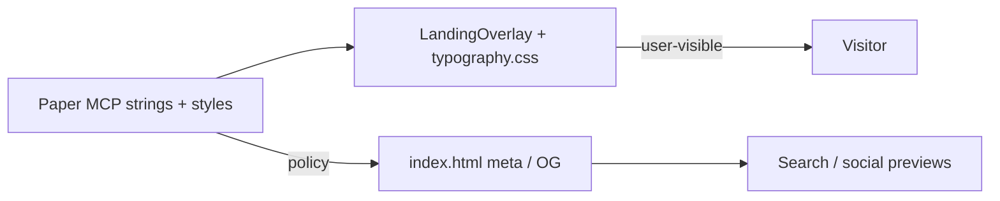

# feat: Align landing body + SOON matchup with Paper (copy + variable type)

## Overview

Take a **second implementation pass** on the marketing overlay so **on-page copy** and the **SOON / team matchup row** match the **current Paper** file (“Pennant”, page “Landing Page”), using **Paper MCP** for authoritative strings and **computed CSS** (including variable-font behavior). The user’s **current selection** (hero column **Frame** `L1W-0` on artboard **Pennant Landing Page** `L1V-0`) defines the scope for this reconciliation.

This plan **does not** restage the WebGL field; it focuses on `LandingOverlay` + `typography.css` (+ related meta/tests).

---

## Problem Statement / Motivation

- **Design source drift:** The brainstorm still lists an older body string (“…a baseball companion for iPhone…”) while **Paper and the repo overlay** now use “…your new baseball companion…”. The **Paper file is the copy authority** for this pass (see brainstorm principle in [docs/brainstorms/2026-04-29-pennant-react-web-landing-brainstorm.md](docs/brainstorms/2026-04-29-pennant-react-web-landing-brainstorm.md) — “Paper artboard… single source of truth”) (see brainstorm: docs/brainstorms/2026-04-29-pennant-react-web-landing-brainstorm.md).
- **Variable font parity:** Paper’s computed styles use **Job Clarendon Variable** with **`fontStretch: ultra-condensed`** and named instance weights (300 / 500 / 600); the web stack sets **`font-variation-settings`** for `wght` / `opsz` but **does not yet map `wdth`** to match ultra-condensed, which the prior plan called out as a follow-up ([docs/plans/2026-04-29-001-feat-pennant-react-web-landing-plan.md](docs/plans/2026-04-29-001-feat-pennant-react-web-landing-plan.md)).
- **SOON row structure:** In Paper, **Team Matchup Logos** (`L1X-0`) is not a flat five-cell row: the **middle “At”** group nests **two `O` glyphs** with a **“Double Divider”** between them (`L23-0` → `L24-0` → `L29-0`, `L26-0`, `L25-0`). The React overlay **repeats a single divider pattern** between every letter, so the **center pair** may not match the design’s emphasis.
- **Marketing vs DOM:** `index.html` meta/OG strings **differ** from `BODY_COPY` (shorter, “iPhone” framing). Crawlers and social previews will not match the hero paragraph unless explicitly reconciled.

---

## Paper MCP design context (2026-04-30)

**Selection:** Frame **“Frame”** `L1W-0` — children: wordmark, display stack frame, body text, matchup frame.

| Role | Paper node | Text / role | Notes |
|------|------------|-------------|--------|
| Wordmark | `L2P-0` | `Pennant` | 32px / 32px lh, wght 600, ultra-condensed, ss03–ss07, `#FEFAE0` |
| Display | `L2O-0` / `L2N-0` / `L2M-0` | `Baseball` / `Without` / `The Noise.` | 96px / 88px lh, uppercase, 600 / 300 / 600 |
| Body | `L2K-0` | Full paragraph (see below) | 16px / 24px lh, SF Pro Light **274** |
| Matchup letters | `L2J-0` … `L1Z-0` | `S` `O` `O` `O` `N` | 40px / 48px lh, wght **500**, ultra-condensed, text-shadow `#0000007A 0 2px 3px` |

**Body paragraph (authoritative from Paper `L2K-0`):**

> Pennant is your new baseball companion. Pick your team once. Open it every day. It tells you what's happening, who's playing, and where your team stands.

**Repo check:** `BODY_COPY` in [`src/components/LandingOverlay.tsx`](src/components/LandingOverlay.tsx) **matches this string exactly** — no copy edit required for the paragraph until Paper changes again.

**Matchup computed styles (representative):** All five letter nodes share Clarendon medium (500), 40px, 48px line-height, ultra-condensed, same shadow; **no** `ss03`–`ss07` on these nodes (unlike display/wordmark).

---

## Proposed Solution

1. **Lock a “copy + type contract”** in-repo (this plan + optional one-row table in README or comment block) listing: body string, meta policy, and Paper reference (page name + hero frame purpose). Update the **brainstorm** or add a short note pointing to **Paper** as superseding the old body row in the table (see brainstorm: docs/brainstorms/2026-04-29-pennant-react-web-landing-brainstorm.md).
2. **Variable typography**
   - Extend Clarendon rules in [`src/styles/typography.css`](src/styles/typography.css) with **`font-variation-settings` / `wdth`** (or `font-stretch`) aligned to Paper’s **ultra-condensed** for wordmark, display, and matchup cells — verify against [`@font-face`](src/styles/typography.css) axis range.
   - Body: Prefer **SF Pro** weight **274** where the stack supports it (e.g. `font-variation-settings: "wght" 274` on Apple system faces if effective in target browsers); document fallback to **300** for stacks where 274 is unavailable.
3. **SOON / matchup row**
   - Refactor markup in [`LandingOverlay.tsx`](src/components/LandingOverlay.tsx) so divider **between the third and fourth letters** uses the **Paper “double divider”** treatment (nested frame `L26-0` behavior), while outer dividers match **single** Paper dividers (`L30-0`, `L2X-0`, `L2U-0`). Derive exact spacing/opacity from **Paper** via `get_computed_styles` on divider nodes (add node IDs to the implementation checklist when exporting).
   - Keep letters **`S` `O` `O` `O` `N`** and preserve `aria-hidden` on the decorative strip.
4. **SEO / social**
   - Decide single marketing message: either **align** `meta`/`og:*` with the hero paragraph, or **document intentional shortening** and align terminology (“iPhone” vs “new companion”) with product. Update [`index.html`](index.html) accordingly.

---

## Technical Considerations

- **Architecture:** Overlay remains a single presentational component; consider extracting **shared `BODY_COPY`** or a `copy.ts` module only if meta is generated or duplicated to avoid drift.
- **Performance:** Adding `wdth` has negligible cost; no shader changes.
- **Security / privacy:** None beyond existing public marketing copy.

---

## System-Wide Impact

- **Interaction graph:** Static text; theme toggle does not alter overlay copy.
- **Error propagation:** N/A.
- **State lifecycle:** None.
- **API surface:** None; **HTML meta** is the secondary public “API” for crawlers — keep in sync by policy.

- **Integration tests:** After matchup markup changes, add or extend tests so **letter order** and **divider variant at index 2** (between 3rd and 4th letter) are covered; keep [`LandingOverlay.test.tsx`](src/components/LandingOverlay.test.tsx) in sync with `BODY_COPY`.

---

## Acceptance Criteria

- [ ] **Body paragraph** in the DOM matches **Paper `L2K-0`** verbatim (currently already true — re-verify after any Paper edit).
- [ ] **Wordmark + display + matchup** use Clarendon **variable** settings that include **width/condensed** behavior consistent with Paper (`ultra-condensed` / `wdth` in documented range).
- [ ] **Body** weight matches Paper intent (**274** with documented fallback), not only generic `300`.
- [ ] **Matchup row** implements **double divider between the two center `O`** glyphs per Paper hierarchy, with outer dividers matching Paper single dividers; visual review against Paper screenshot optional but recommended.
- [ ] **`index.html`** `<title>`, `description`, `og:title`, `og:description` follow an **explicit** policy (same prose as hero, shortened variant with rationale, or build-time single source).
- [ ] **Tests** updated: body substring; optional structural test for matchup **S-O-O-O-N** and **center divider** variant.
- [ ] **Brainstorm / docs:** Note that body copy in the old table is **superseded** by Paper (see brainstorm: docs/brainstorms/2026-04-29-pennant-react-web-landing-brainstorm.md) or refresh that row.

---

## Success Metrics

- Visual sign-off: overlay column at **394px** width matches Paper frame **L1W-0** for type hierarchy and matchup treatment.
- No accidental regression: CI green; a11y tests still pass.

---

## Dependencies & Risks

| Risk | Mitigation |
|------|------------|
| `wdth` values differ by build of Job Clarendon | Compare `get_font_family_info` + Paper export; tune once, document in CSS comment |
| SF Pro 274 not available on all platforms | Acceptable fallback per brainstorm (see brainstorm: docs/brainstorms/2026-04-29-pennant-react-web-landing-brainstorm.md) |
| Double divider mis-implemented | Pull computed styles for Paper divider nodes; screenshot diff |

---

## Research & external docs

- **Local research:** Repo overlay, typography, tests, meta — consolidated above.
- **`docs/solutions/`:** Not present in this workspace; no institutional learnings file.
- **External framework docs:** **Skipped** — implementation is CSS/React-only; Paper MCP + existing plan provide sufficient grounding.

---

## Sources & References

- **Origin brainstorm:** [docs/brainstorms/2026-04-29-pennant-react-web-landing-brainstorm.md](docs/brainstorms/2026-04-29-pennant-react-web-landing-brainstorm.md) — variable-font and Paper-as-source decisions; **body string in the brainstorm table is outdated vs current Paper/repo** (see brainstorm: docs/brainstorms/2026-04-29-pennant-react-web-landing-brainstorm.md).
- **Prior plan:** [docs/plans/2026-04-29-001-feat-pennant-react-web-landing-plan.md](docs/plans/2026-04-29-001-feat-pennant-react-web-landing-plan.md) (R2/R3 trace).
- **Code:** [`src/components/LandingOverlay.tsx`](src/components/LandingOverlay.tsx), [`src/styles/typography.css`](src/styles/typography.css), [`src/styles/global.css`](src/styles/global.css), [`index.html`](index.html), [`src/components/LandingOverlay.test.tsx`](src/components/LandingOverlay.test.tsx).
- **Paper MCP (session):** File **Pennant**, page **Landing Page**, selection **Frame** `L1W-0`; computed styles pulled for `L2P-0`, `L2O-0`–`L2M-0`, `L2K-0`, `L2J-0`, `L2E-0`, `L29-0`, `L25-0`, `L1Z-0`.
